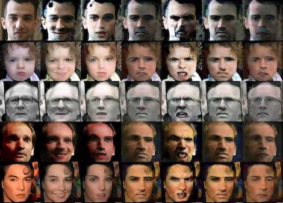

# Conditional Image Generation for Black-Box Model Visualization and Interpretation
<p align="center"></p>

## Motivation
* Typical neural network maps input to output through a superposition of learned tensor-to-tensor transformations applied by each layer. 
* We can decipher which aspects of the image are encoded by intermediate representations by training a generative model which conditions on these representations.

## Model Outline
* [StarGAN](https://arxiv.org/abs/1711.09020) is a powerful model for image-to-image translation i.e. problem of generating an artifical image based on a source image, typically by altering some qualitative aspect of the input.
* It generates fake image from source image conditional on a prescribed target domain label (represented as a one-hot/binary vector).
* In this work we show that analogous training principle can be used to generate meaningful samples when the conditioning vectors are continuous feature vectors extracted from the last layer of a trained classifier.
* Such model allows for direct visualization and interpretation of the feature space.
* Our experiments are done in the context of affective computing: we visualized the learned features of two VGG-Face networks for facial expression recognition.

## Dependencies
* [Python 3.5+](https://www.continuum.io/downloads)
* [PyTorch 0.4.0+](http://pytorch.org/)
* [TensorFlow 1.3+](https://www.tensorflow.org/) (optional for tensorboard)

## Training networks
To train the models on AffectNet, run the training script below.

```bash
# Example training script
python main.py --mode train --dataset AffectNet --affectnet_emo_descr 64d_reg  --image_size 112 \
               --c_dim 64 --lambda_cls 10 --batch_size 16 --d_conv_dim 128 --g_conv_dim 128 --g_lr 0.0001 --d_lr 0.0001 \
               --num_iters 1000000 --test_iters 1000000 --num_iters_decay 9000000 --affectnet_image_dir affectnet \
               --sample_dir 64d_regflat_ccc/samples --log_dir 64d_regflat_ccc/logs \
               --model_save_dir 64d_regflat_ccc/models --result_dir 64d_regflat_ccc/results \
               --use_ccc True --depth_concat False --d_loss_cls_type actv --pca_n_components 3 --pca_variant 'quantiles'

# Example testing script
python main.py --mode test --dataset AffectNet --affectnet_emo_descr 64d_reg --image_size 112 \
               --c_dim 64 --lambda_cls 10 --batch_size 16 --d_conv_dim 128 --g_conv_dim 128 --affectnet_image_dir affectnet \
               --sample_dir 64d_regflat_ccc/samples --log_dir 64d_regflat_ccc/logs \
               --model_save_dir 64d_regflat_ccc/models --result_dir 64d_regflat_ccc/results \
               --test_iters 1000000 --depth_concat False --pca_n_components 3 --pca_variant 'quantiles'
```
